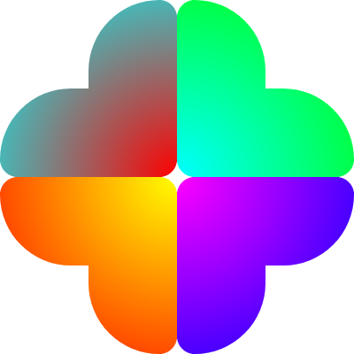

# bratik
Tiny, p5.js-like, typed toolkit to cakewalk through 2d canvas context.  
see [Demo page](https://foretoo.github.io/bratik).

<br/>

## Installation

by npm:
```
npm i bratik
```
and then
```javascript
import { getcanvas, ... } from "bratik"
```
or if you don't use npm you can import module from unpkg:
```javascript
import { getcanvas, ... } from "https://unpkg.com/bratik@latest/dist/bratik.min.js"
```
or by script tag in your html page (this will create the global variable `bratik`):
```html
<script src="https://unpkg.com/bratik@latest/dist/iife/bratik.min.js"></script>
```

<br/>

## Usage

`bratik` exports:
```javascript
{ getcanvas, pxratio, shape, vertex, arc, curve, line, circle, ellipse, rect, mask, clip, font, settext, text, LINEAR, CONIC, RADIAL, gradient, fill, stroke, clear, bg, frame, loop, stop, looping, CLOSE, PI, TAU }
```
<br/>

### Canvas creation
it takes two optional args: width, height
```javascript
getcanvas(100, 100)

// OR
const {
  canvas, // DOM element with width and height of window
  ctx,    // CanvasRenderingContext2D
  width,  // width of window
  height  // height of window
} = getcanvas()
```
<br/>

### Pixel ratio, fill, stroke, clear, bg

get/set, default: client device pixel ratio
```javascript
// get
const pr = pxratio()
// set
pxratio(2)
```
provide null as a color to fill/stroke to remove it.
```typescript
stroke(
  color: string | CanvasGradient | null,
  width?: number,
  lineCap?: string,
  lineLoin?: string
)

fill(color: string | CanvasGradient | null)
```  
`clear()` cleans canvas, `bg(color)` fill canvas with provided color.

<br/>

### Gradient

`gradient()` takes type of gradient `(LINEAR | CONIC | RADIAL)` tag as a first parameter, then other parameters need depending on type.
```typescript
const sunset = 
  gradient(LINEAR, x1: number, y1: number, x2: number, y2: number) ||
  gradient(CONIC, a: number, x: number, y: number) ||
  gradient(RADIAL, x1: number, y1: number, r1: number, x2: number, y2: number, r2: number)
```
returns an object
```typescript
{
  image: CanvasGradient,
  // gradient itself which you can provide into fill,
  // stroke or bg functions, like fill(sunset.image)
  reset: (...options?: number[]) => void
  // reset method to redefine gradient with options provided,
  // as those passed in gradient function after the type tag
  // or just reset it without options
  add: (offset: number, color: string) => void
  // after gradient initiation by type and options
  // add colors by this method, offset should be from 0 to 1
}
```
#### Example
```typescript
const sunrise = gradient(LINEAR, 0, 0, 0, height)
sunrise.add(0, "deepskyblue")
sunrise.add(0.75, "lightpink")
sunrise.add(1, "lightgoldenrodyellow")
bg(sunrise.image)
```
<br/>

### Looper
loop takes a callback to run every animation frame. Call stop to stop the sloop.
```javascript
let x = 20
const play = () => {
  clear()
  stroke(null)
  fill("red")
  circle(x++, height / 2, 10)
  if (frame === 180) stop()
}
loop(play)
```
<br/>

### Animate

animate function takes an object of options:
```typescript
{
  dur: number, // in ms (default: 1000)
  ease: string, // ease tag (default: "linear"),
  loop: boolean, // default: false
  // and callbacks:
  onstart, ontick, onpause, onend
}
```
returns a dinamicly mutable on every animation frame object:
```typescript
{
  dur: number,
  ease: string,
  started: false,
  paused: false,
  ended: false,
  frame: number, // frame number
  time: number, // timestamp
  t: number, // float number from 0 to 1 changing by ease function
  // callbacks
  onstart, ontick, onpause, onend
  // methods
  pause, play, on
}
```
#### Example of how to handle entire animation with ontick callback only:
```javascript
const particle = { x: width / 2, y: height / 2 }
stroke(null)
animate({
  dur: 1000,
  ease: "linear",
  ontick: () => {
    const {t} = move, R = (1 - t) * 255, G = 0, B = t * 255
    fill(`rgb(${R},${G},${B})`)
    particle.y = height / 2 + Math.sin(t * TAU) * (height / 2 - 10)
    particle.x = width / 2 + Math.cos(t * TAU) * (width / 2 - 10)
    circle(particle.x, particle.y, 10)
  }
}).play()
```
#### Example of animation with `.on()` method combined with `loop()`:
`.on(target, props)` takes a target object (or array of objects) with props to animate "from" and an object (or array of objects) with props to animate "to" (gsap-like)
```javascript
const
  particle = { x: 10, y: 10 },
  move = animate({ dur: 900 })

stroke(null)
fill("black")
move.on(particle, { x: width - 10, y: height - 10 })
loop(() => {
  circle(particle.x, particle.y, 10)
})
```
<br/>

### Shape, circle, ellipse, rect, line
first call shape to initiate it, then you may call vertex(x, y), arc(x1, y1, x2, y2, r) or curve(x1, y1, x2, y2, x3?, y3?), once shape is finished call it again, provide CLOSE tag as a parameter to close it if needed.
```javascript
const
  radius = 50,
  sidesnum = 6,
  angle = TAU / sidesnum,
  offset = PI / 2,

  vx = (i) => width / 2 + Math.cos(angle * i + offset) * radius,
  vy = (i) => height / 2 + Math.sin(angle * i + offset) * radius

shape()
for (let i = 0; i < sidesnum; i++) {
  i % 2 === 0
    ? vertex(vx(i), vy(i))
    : arc(vx(i), vy(i), vx(i + 1), vy(i + 1), radius)
}
curve(width / 2 + 50, height / 2 + 75, width / 2, height / 2 + 50)
shape(CLOSE)
```
`cirlce` takes: x, y of center and radius.
`ellipse` takes: x, y of center, rx, ry radii; and optionaly: rotation, 'from' and 'to' of an arc in radians, and boolean if direction is counterclockwise.
`rect` takes: x, y, width, height and optionally radius if you want rounded corners.
`line` takes: x1, y1, x2, y2.
```javascript
const
  size = 20,
  cx = width / 2,
  cy = height / 2,

  vx = (x, len) => x + Math.cos(frame * 0.01) * len,
  vy = (y, len) => y + Math.sin(frame * 0.01) * len

stroke("black", 2)
fill("white")
loop(() => {
  clear()
  ellipse(cx, cy, size * 2, size * 1.333, Math.PI / 4)
  rect(cx - size, cy - size, size * 2, size * 2, 5)
  circle(cx, cy, size)
  line(cx, cy, vx(cx, size), vy(cy, size))
})
```
<br/>

### Mask
You need to define mask shape in between `mask()` and `mask(CLOSE)` calls, it could be any number of — shape (and vertex, arc, curve), circle, ellipse or rect — calls. Then draw anything you like to clip by mask, after you done just call clip()
```javascript
const size = 100
const hex = [ "FF", "00" ]

getcanvas(size * 2)

const sun = gradient(RADIAL, size, size, 0, size, size, size * Math.SQRT2)
const getcolor = () => "#".concat(Array(3).fill("")
  .map(() => hex[Math.round(Math.random())]).join(""))

for (let i = 0; i < 4; i++) {
  const x = i % 2 ? size : 0
  const y = i > 1 ? size : 0

  // define mask
  mask()
  rect(x, y, size, size)
  mask(CLOSE)

  // drawing
  sun.reset()
  sun.add(0, getcolor())
  sun.add(1, getcolor())
  bg(sun.image)

  // clipping
  clip()
}
```
you will get something like this:

<br/><br/>

### Text
font takes size (number or string, to set line height provide it after slash like this "16/20"), family, and options like "bold". settext takes CanvasTextAlign, optionally CanvasTextBaseline and width. text takes string of content, x and y of its pivot and optionally width.
```javascript
stroke(null)
fill("blue")
font(21, "monospace", "italic")
settext("center", "middle")
text("Hello world!", width / 2, height / 2)
```